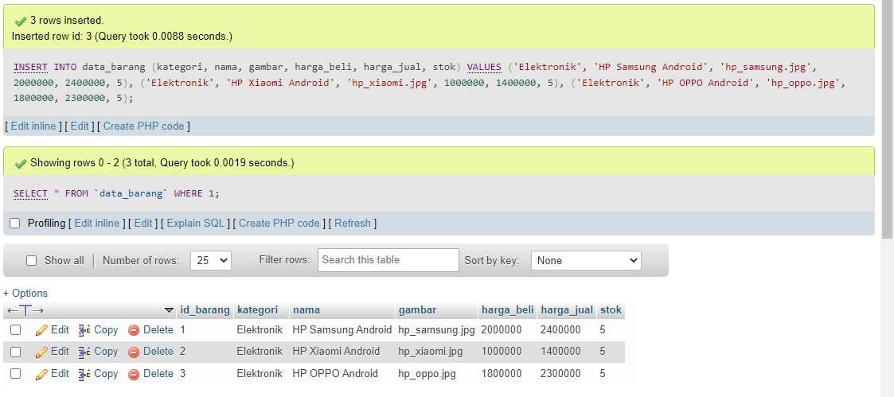
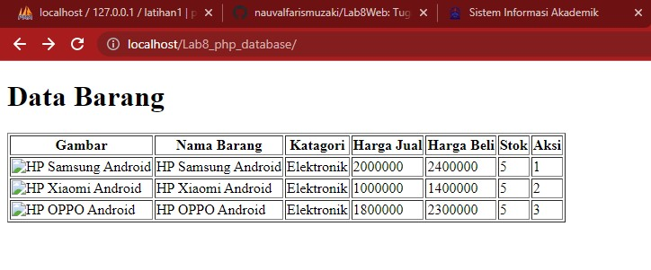

# Lab8Web
Tugas pertemuan 10
| Nama | Moch. Nauval Faris Muzaki |
| --- | --- |
| NIM | 312010122 |
| Kelas | TI.20.B1
| Mata Kuliah | Pemrograman Web |

1. **Membuat Tabel**  
Untuk langkah awal pada tugas kali ini saya akan membuat tabel terlebih dahulu, Berikut contohnya.

 

2. **Menambahkan Data**  
selanjutnya saya akan membuat data 

  

3. **Membuat File index**
Membuat file index untuk menampilkan file baru, Berikut contohnya.

